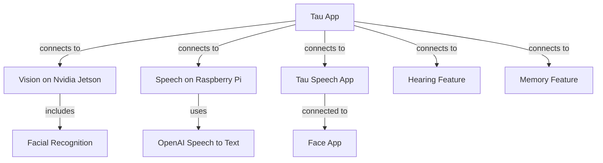

# General 

Main app “Tau” on Raspberry  Pi connects to “Vision” on a Nvidia Jetson device including Facial recognition.  
Tau is also connected to “speech” on current device by using OpenAI speech to text and a “Tau Speech” app, and to “Face app” “Tau speech” also connected to the “Face app”.  
“Tau” also connected to hearing, and memory features.

## Visual

### Modules and Their Roles

1. **Face Module**
   - **Function**: Display visual cues and expressions.
   - **Hardware**: Raspberry Pi
   - **Communication**: Direct control via Raspberry Pi.

2. **Speech (TTS)**
   - **Function**: Convert text to speech.
   - **Hardware**: Raspberry Pi
   - **Communication**: Output to Bluetooth speaker.

3. **Passive Hearing**
   - **Function**: Listen for user input.
   - **Hardware**: Car Speaker (Microphone)
   - **Communication**: Input via Bluetooth to Raspberry Pi.

4. **Passive Vision**
   - **Function**: Capture visual input.
   - **Hardware**: Nvidia Jetson Nano
   - **Communication**: Process locally, then send relevant data to Raspberry Pi via Websockets.

5. **Facial Recognition**
   - **Function**: Identify and recognize faces.
   - **Hardware**: Nvidia Jetson Nano
   - **Communication**: Process locally, then send relevant data to Raspberry Pi via Websockets.

6. **Speech Comprehension (STT)**
   - **Function**: Convert speech to text.
   - **Hardware**: Raspberry Pi
   - **Communication**: Input from car speaker via Bluetooth, processed locally.

7. **Thinking/Personality (LLM)**
   - **Function**: Process conversations, generate responses.
   - **Hardware**: Raspberry Pi
   - **Communication**: Process locally, integrate with other modules via Websockets.

8. **Memory**
   - **Function**: Store and retrieve conversational context and embeddings.
   - **Hardware**: Raspberry Pi
   - **Components**: 
     - RAG (Retrieval-Augmented Generation)
     - Embeddings + Vector DB
     - Ongoing textual references
   - **Communication**: Direct access by Raspberry Pi, data storage and retrieval.

### Communication Overview

- **Websockets**: For communication between Raspberry Pi and Nvidia Jetson Nano.
- **Bluetooth**: For communication between Raspberry Pi and car speaker (for both microphone and speaker functionalities).

### Detailed Configuration

1. **Raspberry Pi (Main Machine)**
   - **Modules**: Face, Speech (TTS), Speech Comprehension (STT), Thinking/Personality (LLM), Memory.
   - **Tasks**: 
     - Convert text to speech.
     - Process speech to text.
     - Manage conversation logic.
     - Store and retrieve memory data.
   - **Communication**: 
     - Bluetooth for speaker and microphone input/output.
     - Websockets for receiving processed visual data from Nvidia Jetson Nano.

2. **Nvidia Jetson Nano (Vision Processing)**
   - **Modules**: Passive Vision, Facial Recognition.
   - **Tasks**: 
     - Capture and process visual input.
     - Perform facial recognition.
   - **Communication**: Send processed visual data to Raspberry Pi via Websockets.

3. **Car Speaker (Audio Processing)**
   - **Modules**: Microphone, Speaker.
   - **Tasks**: 
     - Capture audio input.
     - Output audio responses.
     - Manage echo cancellation.
   - **Communication**: Bluetooth connection with Raspberry Pi for audio data.

