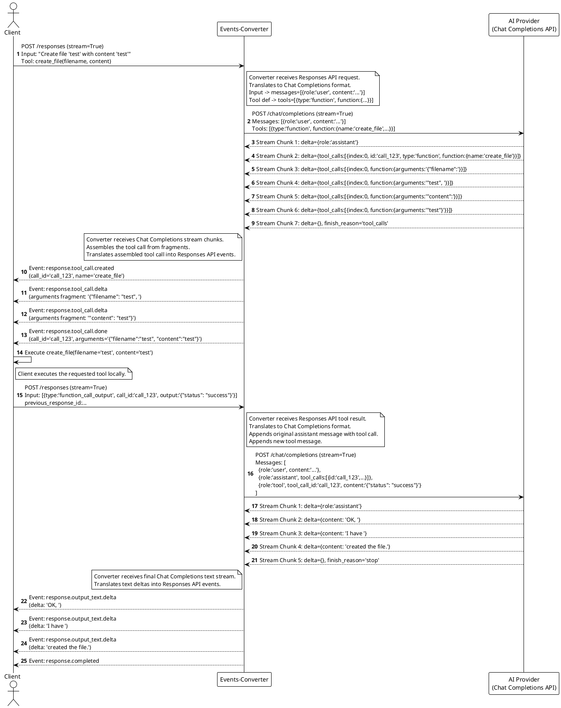

Okay, here is a sequence diagram illustrating the flow you described, showing the interaction between the Client, the Events-Converter, and the AI Provider (acting as a Chat Completions endpoint).

**Explanation:**

1.  **Client Request (Responses API):** The client initiates the request using the Responses API format, specifying the task and the available `create_file` tool.
2.  **Converter Translation (Req -> Chat):** The converter translates this into a Chat Completions request, formatting the input as messages and including the tool definition.
3.  **Provider Tool Call (Chat Stream):** The AI Provider decides to use the tool and streams back the tool call information fragmented across multiple `delta` chunks, typical of the Chat Completions API.[1, 2]
4.  **Converter Translation (Chat Stream -> Resp Events):** The converter receives the fragmented tool call deltas, assembles the complete call details (`id`, `name`, `arguments`), and translates this into a sequence of Responses API semantic events (`response.tool_call.created`, `response.tool_call.delta`, `response.tool_call.done`).[3]
5.  **Client Tool Execution:** The client receives the clear semantic events, understands the tool request, executes the `create_file` function locally, and prepares the result.
6.  **Client Result (Responses API):** The client sends the result back using the Responses API format, referencing the `call_id`.[3, 4]
7.  **Converter Translation (Resp Result -> Chat Msg):** The converter translates the Responses API result into the required Chat Completions format: appending the original assistant message containing the tool call and adding a new message with `role: "tool"` containing the result and `tool_call_id`.[5, 6]
8.  **Provider Final Response (Chat Stream):** The AI Provider processes the tool result and generates the final text confirmation, streaming it back via `delta.content` chunks.[7, 8]
9.  **Converter Translation (Chat Stream -> Resp Events):** The converter translates the incoming text deltas into `response.output_text.delta` events.[3]
10. **Client Completion:** The client receives the final text via semantic events and displays the complete response.

This diagram illustrates how the converter acts as a translation layer, handling the complexities of Chat Completions streaming (especially for tool calls) and presenting a cleaner, event-based interface (Responses API style) to the client, while also translating the client's Responses API inputs back into the format expected by the Chat Completions provider.