# 🔬 Data Refinery

**Transform documents into structured knowledge graphs → Generate new documents & Q&A pairs**

Extract entities and relationships from PDFs using vLLM, store them in Neo4j, then use that knowledge to generate synthetic training data.


## Quick Start

```bash

# 1. Clone & setup
git clone <repo-url> && cd data-refinery
cp .env.sample .env  # Add your HF_TOKEN

# 2. Start services
docker compose up -d

# 3. Install dependencies
./init_env.sh

# 4. Extract knowledge from a document
uv run python refinery.py -i your-document.pdf -o output/

# 5. Generate Q&A pairs from the graph
uv run python generator.py qa --count 10 -o output/generated
```

## Architecture

```mermaid
flowchart LR
    PDF[📄 PDFs] --> R[Refinery]
    R --> |Entities & Relations| J[(JSON)]
    J --> |Cypher| N[(Neo4j)]
    N --> G[Generator]
    G --> D[📝 Documents]
    G --> Q[❓ Q&A Pairs]
    
    subgraph Services
        V[vLLM] --> R
        V --> G
        T[TEI] -.-> R
    end
```



## CLI Reference

### Refinery — Extract knowledge

```bash
# Single document
uv run python refinery.py -i document.pdf -o output/

# Directory of PDFs
uv run python refinery.py -i docs/ -o output/

# With embeddings
uv run python refinery.py -i doc.pdf -o output/ --generate-embeddings

# Resume interrupted job
uv run python refinery.py -i docs/ -o output/ --resume
```

### Generator — Create training data

```bash
# Generate documents
uv run python generator.py documents --count 5

# Generate Q&A pairs
uv run python generator.py qa --count 20 --guidance "Focus on technical concepts"
```

## Services

| Service | Port | Description |
|---------|------|-------------|
| vLLM | 8100 | Nemotron-3 inference |
| Neo4j | 7474/7687 | Graph database |
| TEI | 8101 | Embeddings (optional) |

```bash
docker compose up -d           # All services
docker compose up -d neo4j     # Just Neo4j
docker compose up vllm         # vLLM (foreground)
```

## Documentation

- **[Getting Started](docs/getting-started.md)** — Full setup walkthrough
- **[Refinery Guide](docs/refinery.md)** — Entity extraction deep dive
- **[Generator Guide](docs/generator.md)** — Document & Q&A generation
- **[MCP Server](docs/mcp-server.md)** — FastMCP Neo4j integration
- **[Architecture](docs/architecture.md)** — Data flow & components

## License

MIT
