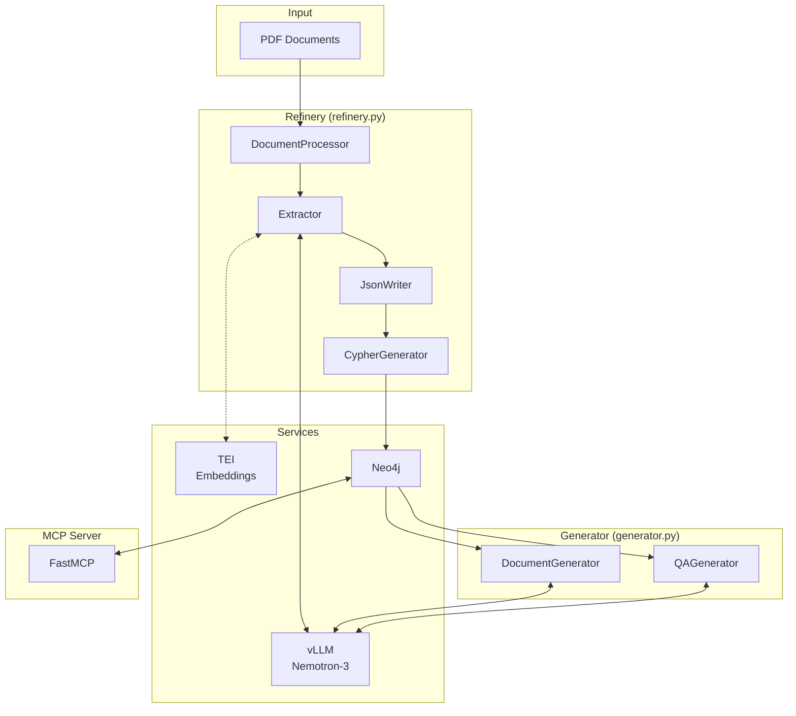

# Architecture

Technical overview of Data Refinery components and data flow.

## System Overview



## Core Components

### DocumentProcessor (`src/document_processor.py`)

Handles PDF parsing and sliding window generation.

```python
class SlidingWindow:
    document_name: str
    start_page: int
    end_page: int
    content: str
```

- Uses PyMuPDF for PDF extraction
- Generates overlapping windows (default: 3 pages)
- Handles single files or directories

### Extractor (`src/extractor.py`)

Two-phase entity and relationship extraction.

**Entity Extraction:**
- Single LLM call per window
- Structured JSON output with Pydantic validation
- Types: name, concept, feature, location

**Relationship Extraction:**
- Iterative calls until `continue_extraction: false`
- Maximum iterations configurable
- Leverages vLLM prefix caching

### Models (`src/models.py`)

Pydantic data models:

```python
class Entity:
    id: str
    name: str
    type: str  # name, concept, feature, location
    description: str
    source_page: int
    embedding: Optional[List[float]]

class Relationship:
    source_entity_id: str
    target_entity_id: str
    type: str
    description: str
    source_page: int
```

### JsonWriter (`src/json_writer.py`)

Writes extraction results to JSON files.

Pattern: `{document}_{start_page}.json`

### CypherGenerator (`src/cypher_generator.py`)

Converts JSON to Neo4j Cypher import script.

- Creates unique constraints on entity IDs
- Uses MERGE to deduplicate entities across windows
- Creates relationships with descriptions

### State (`src/state.py`)

Tracks processing progress for resume support.

```python
class ProcessingState:
    processed_windows: Dict[str, List[int]]
    total_entities: int
    total_relationships: int
```

### EmbeddingClient (`src/embeddings.py`)

Optional integration with Text Embeddings Inference (TEI).

- Generates embeddings for entity descriptions
- Uses Snowflake Arctic Embed by default

## Generator Components

### GeneratorConfig

```python
@dataclass
class GeneratorConfig:
    vllm_url: str
    model: str
    neo4j_uri: str
    neo4j_user: str
    neo4j_password: str
    output_dir: str
```

### Neo4jGraphClient

Queries the graph for entity clusters:
- `get_random_entities()` — Random sampling
- `get_related_entities()` — Neighborhood traversal
- `get_entity_cluster()` — Connected subgraph

### DocumentGenerator / QAGenerator

LLM-based generation from entity context.

## Docker Services

### vLLM (`data-refinery-vllm`)

- **Image:** `nvcr.io/nvidia/vllm:25.12.post1-py3`
- **Port:** 8100
- **Model:** Nemotron-3-Nano-30B-A3B-FP8
- **Features:** Prefix caching, tool calling, FP8 inference

### Neo4j (`data-refinery-neo4j`)

- **Image:** `neo4j:5-community`
- **Ports:** 7474 (UI), 7687 (Bolt)
- **Plugins:** APOC

### TEI (`data-refinery-tei`)

- **Image:** `ghcr.io/huggingface/text-embeddings-inference:1.8`
- **Port:** 8101
- **Model:** Snowflake Arctic Embed L v2.0

## Data Flow

```
1. PDF → DocumentProcessor → SlidingWindow[]
2. SlidingWindow → Extractor → WindowExtractionResult
3. WindowExtractionResult → JsonWriter → *.json
4. *.json → CypherGenerator → import.cypher
5. import.cypher → Neo4j (cypher-shell)
6. Neo4j → Generator → Documents / Q&A pairs
```

## Extension Points

### Custom Models

Change `MODEL_ID` in `.env` or use `--model` flag.

### Custom Embeddings

Set `EMBEDDING_MODEL_ID` in `.env` for TEI.

### Custom Entity Types

Modify prompts in `src/extractor.py`:
- `ENTITY_EXTRACTION_PROMPT`
- `RELATIONSHIP_EXTRACTION_PROMPT`

### MCP Integration

Extend `src/mcp_server.py` with additional tools.
