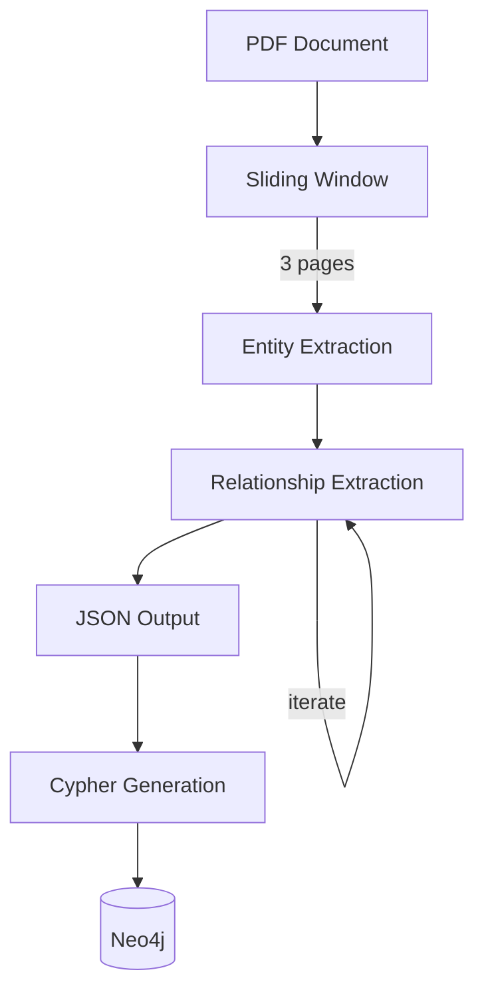

# Refinery Guide

The refinery extracts entities and relationships from documents using a sliding window approach with vLLM.

## How It Works



### Sliding Window

Documents are processed in overlapping windows (default: 3 pages). This:
- Handles large documents without context overflow
- Captures cross-page relationships
- Enables resume support for long jobs

### Two-Phase Extraction

1. **Entity extraction** — Single LLM call per window extracts all entities
2. **Relationship extraction** — Iterative calls until model signals completion (max 5 iterations)

## CLI Reference

```bash
uv run python refinery.py [OPTIONS]
```

### Required Options

| Option | Description |
|--------|-------------|
| `-i, --input` | PDF file or directory of PDFs |
| `-o, --output` | Output directory for JSON/Cypher |

### Processing Options

| Option | Default | Description |
|--------|---------|-------------|
| `--window-size` | 3 | Pages per sliding window |
| `--max-relationship-iterations` | 5 | Max relationship extraction rounds |
| `--model` | `nvidia/NVIDIA-Nemotron-3-Nano-30B-A3B-FP8` | Model ID |
| `--vllm-url` | `http://localhost:8000/v1` | vLLM endpoint |

### Resume & State

| Option | Description |
|--------|-------------|
| `--resume` | Skip already processed windows |
| `--clean` | Delete state and start fresh |

State is stored in `output/.refinery_state.json`.

### Cypher Options

| Option | Description |
|--------|-------------|
| `--cypher-only` | Generate Cypher from existing JSON (no extraction) |
| `--skip-cypher` | Skip Cypher generation |

### Embeddings

| Option | Description |
|--------|-------------|
| `--generate-embeddings` | Add embeddings to entities via TEI |
| `--embeddings-url` | TEI endpoint (default: `http://localhost:8101/v1`) |

## Examples

### Basic extraction

```bash
uv run python refinery.py -i paper.pdf -o output/
```

### Large document with resume

```bash
# Start processing (can interrupt with Ctrl+C)
uv run python refinery.py -i thesis.pdf -o output/ --resume

# Resume later
uv run python refinery.py -i thesis.pdf -o output/ --resume
```

### Custom model/endpoint

```bash
uv run python refinery.py -i doc.pdf -o output/ \
  --vllm-url http://gpu-server:8100/v1 \
  --model nvidia/NVIDIA-Nemotron-3-Nano-30B-A3B-FP8
```

### With embeddings

```bash
docker compose up -d tei  # Start TEI first
uv run python refinery.py -i doc.pdf -o output/ --generate-embeddings
```

### Regenerate Cypher only

```bash
uv run python refinery.py -o output/ --cypher-only
```

## Output Format

### JSON Files

Each window produces a JSON file: `{document}_{start_page}.json`

```json
{
  "document_name": "paper.pdf",
  "start_page": 1,
  "end_page": 3,
  "entities": [
    {
      "id": "machine_learning",
      "name": "Machine Learning",
      "type": "concept",
      "description": "A field of AI...",
      "source_page": 1,
      "embedding": [0.1, 0.2, ...]
    }
  ],
  "relationships": [
    {
      "source_entity_id": "machine_learning",
      "target_entity_id": "neural_networks",
      "type": "INCLUDES",
      "description": "ML includes...",
      "source_page": 2
    }
  ]
}
```

### Entity Types

- **name** — People, organizations
- **concept** — Ideas, fields, methods
- **feature** — Capabilities, attributes
- **location** — Places, regions

## Neo4j Import

After extraction, import to Neo4j:

```bash
cat output/import.cypher | docker exec -i data-refinery-neo4j cypher-shell -u neo4j -p refinerypass
```

The Cypher script:
1. Creates unique constraints
2. Merges entities (deduplicates across windows)
3. Creates relationships
