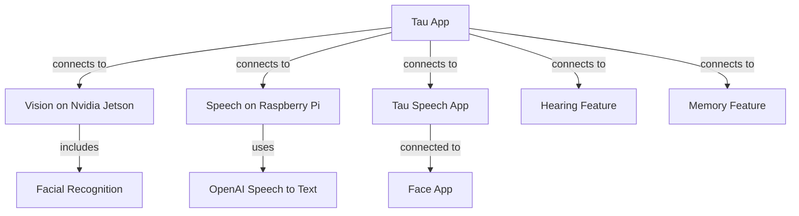

# General 

Main app “Tau” on Raspberry  Pi connects to “Vision” on a Nvidia Jetson device including Facial recognition.  
Tau is also connected to “speech” on current device by using OpenAI speech to text and a “Tau Speech” app, and to “Face app” “Tau speech” also connected to the “Face app”.  
“Tau” also connected to hearing, and memory features.

## Visual
